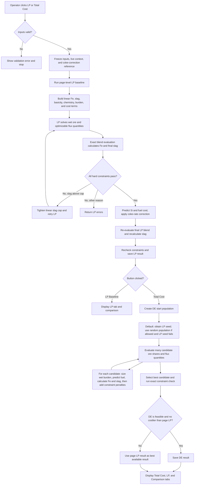

# BMO results: LP and Total Cost (DE) flow

## Scope and terminology

This note describes what the Blend Mix Optimizer (BMO) calculates after an
operator clicks **Run LP Baseline** or **Run Total Cost Optimizer**.

The BMO screen calls the second path **Total Cost (DE)**, where DE means
Differential Evolution. This note treats "Total DP" as a reference to that
button, not to the blast-furnace Total DP process tag.

## End-to-end flow

Important current behavior: clicking **Run Total Cost Optimizer** always runs
and saves the page-level LP result first. With the default `lp_else_random`
start strategy, the DE runner also obtains an LP seed internally. Choosing the
`random` start skips only this internal seed LP; it does not skip the page-level
LP run.

## Calculation order inside one blend evaluation

| Order | Calculation | Main output |
|---:|---|---|
| 1 | Read solved wet ore quantities and calculate ore shares | Wet MT and share % by ore |
| 2 | Convert every ore from wet to dry using moisture | Dry MT by ore |
| 3 | Calculate dry Fe contribution for every ore and sum it | Fe MT and final Fe % |
| 4 | Calculate dry-weight average ore chemistry | FeO, SiO2, Al2O3, CaO, MgO, and other oxides |
| 5 | Calculate preliminary ore, fuel-ash, and flux slag contributions | Simplified slag MT |
| 6 | Calculate charge count and resolve the BF gas-dust deduction | Dust MT/components used by the balance |
| 7 | If full slag balance is enabled, replace simplified slag with the full BF component balance | Final slag MT and final slag components |
| 8 | Calculate basicity, T-basicity, IB4, Al2O3 %, MgO %, and slag rate | Slag quality and kg/THM |
| 9 | Calculate ore cost and combine it with fuel cost | Rs/THM objective |
| 10 | Check production, stock, shares, burden capacity, slag, and slag-quality limits | Feasible flag and violations |

The full slag balance is enabled by default in `setting_bmo.yml`. Its internal
order is:

1. Convert ore, flux, fuel, and dust inputs to dry component masses.
2. Add ore + flux + fuel ash, then subtract BF gas dust.
3. Partition Fe, Mn, Ti, P, and Zn into theoretical/actual pig iron.
4. Remove SiO2 consumed by hot-metal silicon production.
5. Convert remaining Fe to FeO and remaining Mn to MnO.
6. Split sulphur between hot metal, gas, and slag; apply the alkali-to-slag split.
7. Sum final slag components: alkali + SiO2 + Al2O3 + CaO + MgO + FeO + MnO + S + CaF2.
8. Apply the configured slag correction factor.

Therefore, ore dry weight and Fe are calculated before final slag in a single
blend evaluation. Slag is not calculated only once at the very end: it is used
during LP linearization, recalculated after the LP solve for exact validation,
and recalculated again after the final corrected fuel rates are known. During
DE, the same Fe/slag evaluation runs for every candidate blend.

## What each button optimizes

| Button | Decision variables | Cost basis used to choose the blend | Constraint treatment |
|---|---|---|---|
| **Run LP Baseline** | Wet ore MT and enabled optimizable flux MT | Ore + flux purchase cost plus the linear physics coke-correction signal | Hard linear constraints, followed by exact validation |
| **Run Total Cost Optimizer** | Ore shares and enabled optimizable flux MT | Ore + model fuel + flux cost, plus penalties | DE uses soft penalties while searching; the selected result receives an exact final check |

The displayed total cost is ore cost + fuel cost re-priced at the operator's
current fuel prices + optimizer-added flux cost. The DE search itself uses its
baseline model-price objective, so the displayed current-price value can differ
from the scalar used to rank candidates.

## Result outputs

Both result tabs show the selected ore quantities/shares, production basis,
ore/fuel/flux cost, fuel rates, charging requirement, final Fe, slag MT,
slag kg/THM, CaO/SiO2 basicity, IB4, slag chemistry, constraint violations,
and detailed slag-source/component diagnostics. The Comparison tab places the
manual blend, LP result, and DE result on the same target-hot-metal basis.

## Code map

- Button orchestration and result guardrail: `src/custom_pages/9_Blend_Optimizer.py`
- LP construction, solve, exact slag retry: `src/utils/bmo/lp_solver.py`
- Per-blend ore, Fe, slag, and cost order: `src/utils/bmo/calculations.py`
- Full component slag ledger: `src/utils/bmo/slag_balance.py`
- Fuel prediction, coke correction, and final slag re-evaluation: `src/utils/bmo/fuel_prediction.py`
- DE candidate generation and selection: `src/utils/bmo/nonlinear_optimizer.py`
- DE total-cost objective and penalties: `src/utils/bmo/objective.py`
